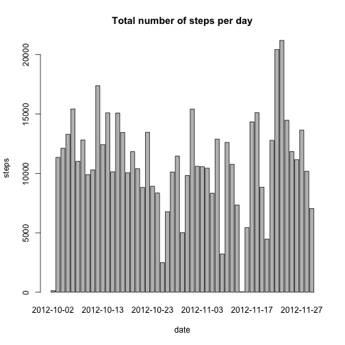
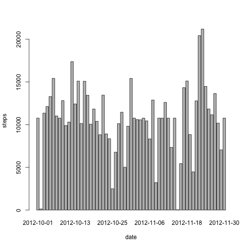

Peer Assessment 1
=================

## Loading and preprocessing the data
### Load the  data

This code chunks describes how to load the data:

```r
setwd("/Users/sergio/datasciencecoursera/RepData_PeerAssessment1")
unzip("activity.zip")
data <- read.csv("activity.csv",header=T)
```


## Answering the analysis questions

### What is mean total number of steps taken per day?
This histogram shows the total number of steps taken each day

```r
steps.date <- aggregate(steps ~ date, data=data, FUN=sum)
barplot(steps.date$steps, names.arg=steps.date$date, xlab="date", ylab="steps", main="Total number of steps per day")
```

 

This code chunk calculates the meand and median total number of days:

```r
dataMean <- mean(steps.date$steps)
dataMedian <- median(steps.date$steps)
```

The mean total number of steps taken per day is 1.0766 &times; 10<sup>4</sup> and the median total number of steps taken per day is 10765.

### What is the average daily activity pattern?
This plot shows the 5-minute interval (x-axis) and the average number of steps taken, averaged across all days (y-axis)


```r
steps.interval <- aggregate(steps ~ interval, data=data, FUN=mean)
plot(steps.interval, type="l")
```

 

This code chunk calculates the 5-minute interval, on average across all the days in the dataset, that contains the maximum number of steps?


```r
maximumNumber<- steps.interval$interval[which.max(steps.interval$steps)]
```

The answer is 835.

### Imputing missing values
This code calculates the total number of missing values in the dataset (i.e. the total number of rows with NAs).

```r
mvSum <- sum(is.na(data))
```
The total number of missing values is 2304.

#### Strategy for filling in the missing values
The method for filling in all of the mussing values in the dataset will be to use the means for the 5-minute intervals as fillers for missing values.
This code chunk reintegrates the missing values:

```r
mvData <- merge(data, steps.interval, by="interval", suffixes=c("",".y"))
nas <- is.na(mvData$steps)
mvData$steps[nas] <- mvData$steps.y[nas]
mvData <- mvData[,c(1:3)]
```

This histogram shows the total number of steps taken each day using the missing values.


```r
mvSteps.date <- aggregate(steps ~ date, data=mvData, FUN=sum)
barplot(mvSteps.date$steps, names.arg=mvSteps.date$date, xlab="date", ylab="steps")
```

 

This code chunk calcultares the mean and median total number of steps taken per day using the missing values.

```r
mvDataMean <- mean(mvSteps.date$steps)
mvDataMedian <- median(mvSteps.date$steps)
```

The mean and median didn't vary because of the method used to input the missing values.

### Are there differences in activity patterns between weekdays and weekends?

The daytype function will indicate whether a given date is a weekday or weekend day.


```r
daytype <- function(date) {
    if (weekdays(as.Date(date)) %in% c("Saturday", "Sunday")) {
        "weekend"
    } else {
        "weekday"
    }
}
data$daytype <- as.factor(sapply(data$date, daytype))
```

This panel plot contains a time series plot of the 5-minute interval (x-axis) and the average number of steps taken, averaged across all weekday days or weekend days (y-axis).


```r
par(mfrow=c(2,1))
for (type in c("weekend", "weekday")) {
    steps.type <- aggregate(steps ~ interval,
                            data=data,
                            subset=data$daytype==type,
                            FUN=mean)
    plot(steps.type, type="l", main=type)
}
```

 
